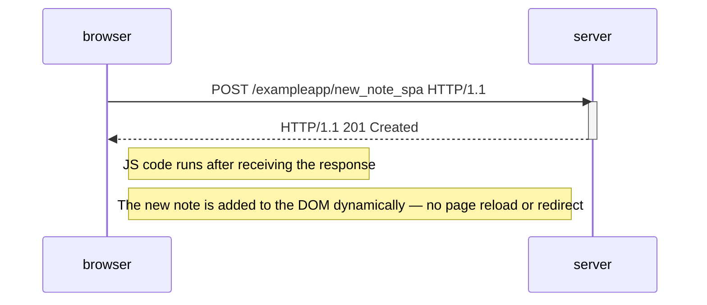

```mermaid
sequenceDiagram
    participant browser
    participant server

    browser->>server: POST /exampleapp/new_note_spa HTTP/1.1
    activate server
    server-->>browser: HTTP/1.1 201 Created
    deactivate server

    Note right of browser: JS code runs after receiving the response

    Note right of browser: The new note is added to the DOM dynamically — no page reload or redirect

```